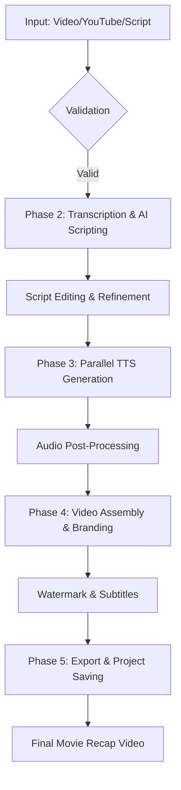

# 🎬 Ultimate Burmese AI Movie Recap Studio

**Ultimate Burmese AI Movie Recap Studio** is a comprehensive, production-ready application designed to transform movies and videos into engaging Burmese AI-generated recaps. By integrating cutting-edge AI technologies, it provides a seamless workflow from video input to final branded output.

---

## 🚀 Project Overview

This project was developed by analyzing and synthesizing the best features from **11 high-quality open-source repositories**. It combines advanced video understanding, AI scriptwriting, professional Burmese text-to-speech, and automated video editing into a single, user-friendly Streamlit interface.

---

## 🛠 Source Attribution & Research

This "Ultimate" version is built upon the research and code patterns of the following projects:

| Source Repository | Key Features Integrated |
| :--- | :--- |
| **muyarmuyarpar-crypto/movie-recap-bot** | Telegram bot integration & basic recap logic |
| **movierecapbot/movie-recap-bot-pro** | Professional UI layout & Gemini integration |
| **Shangyi69/mm-movie-recap-bot** | Burmese language localization patterns |
| **thanwailwin14-png/Thaung-wai-lwin** | React-based web app structure & UI ideas |
| **Minhal-Ahmed/CineRecap** | Core Python logic for movie analysis |
| **myintwai/movie-recap-ai** | YouTube integration & automation |
| **yannainglynntt-ship-it/My-recap-ai** | FastAPI backend & high-performance processing |
| **xiaohu2206/movie-recap-clone** | Advanced video processing pipelines |
| **ytscriptmm-a11y/movie-recap-ai** | Feature-rich studio capabilities |
| **aidenforwechat-design/auto-recap** | SRT-based automation & subtitle handling |
| **aipromptguidevideos-coder/pro-dubbing-engine-pro** | Precise audio timing & parallel TTS generation |

---

## 🗺 Detailed Roadmap (5 Phases)

The development follows a structured 5-phase roadmap:

### 📍 Phase 1: Core Setup & Input Handling
- **Multi-Source Input:** Support for Local Files (MP4, MKV), YouTube URLs, and Document Scripts (PDF, DOCX).
- **Validation:** Automated file size, format, and metadata extraction (Duration, Resolution, FPS).
- **Security:** Secure API key management for Gemini and OpenAI.

### 📍 Phase 2: AI Script Generation & Editing
- **Transcription:** OpenAI Whisper integration for high-accuracy audio-to-text.
- **AI Scripting:** Google Gemini 2.0 Flash for creative Burmese script writing.
- **Studio Editor:** Full-featured script editor with AI refinement and translation capabilities.

### 📍 Phase 3: Audio & Voiceover Production
- **Multi-Lingual TTS:** Support for Burmese and 5 other languages using Edge TTS.
- **Voice Customization:** Gender selection, speed (0.5x to 2.0x), and pitch control.
- **Parallel Processing:** Batch audio generation for lightning-fast results.

### 📍 Phase 4: Video Assembly & Branding
- **Smart Merging:** Automatic synchronization of voiceover with video footage.
- **Professional Branding:** Customizable watermarks/logos and automated subtitle overlay.
- **Optimization:** Multi-format resizing (16:9, 9:16, 1:1) for various social platforms.

### 📍 Phase 5: Deployment & Project Management
- **Database:** SQLite-backed project tracking and history.
- **Management:** Automated backup system, project export/import, and file organization.
- **Export:** Direct high-quality video downloads and cloud storage placeholders.

---

## 🔄 System Workflow



---

## ⚙️ Technology Stack

- **Frontend:** Streamlit
- **AI Engines:** Google Gemini 2.0 Flash (Script), OpenAI Whisper (Transcription)
- **Voice:** Edge TTS (Burmese & Multi-lang)
- **Video Engine:** MoviePy + FFmpeg
- **Data:** SQLite (Project Tracking)
- **Language:** Python 3.8+

---

## 📦 Installation & Setup

For detailed installation instructions, please refer to the [INSTALLATION.md](INSTALLATION.md) file.

```bash
git clone https://github.com/footlivebyprgt/ultimate-burmese-ai-movie-recap-studio.git
pip install -r requirements.txt
streamlit run streamlit_app.py
```

---

## 📄 Development Summary

A complete technical breakdown of the project can be found in [DEVELOPMENT_SUMMARY.md](DEVELOPMENT_SUMMARY.md).

---

## 🤝 Contributing

Contributions are welcome! Please feel free to submit a Pull Request.

## 📄 License

This project is licensed under the MIT License - see the LICENSE file for details.

---
**Made with ❤️ for Burmese Content Creators**
